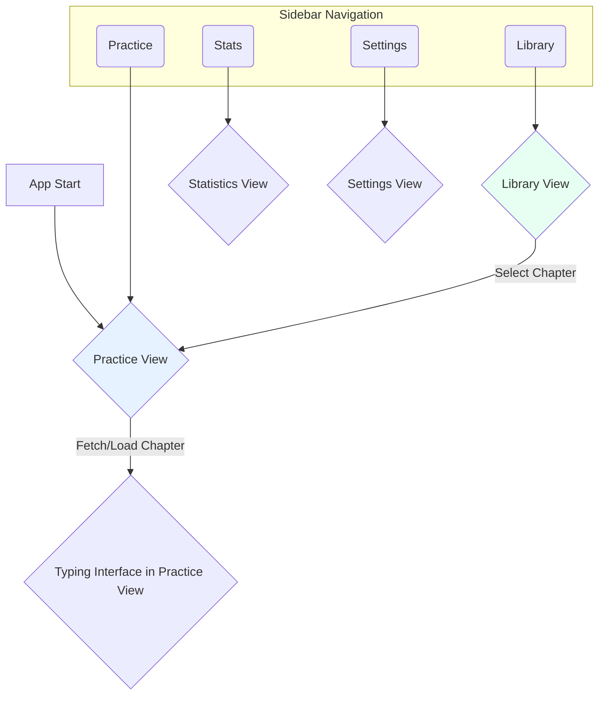

# Application Design Overview

This document outlines the high-level design for the modern user interface of the Typing App.

## 1. Core Design Philosophy

The new UI will be based on a **sidebar navigation** model. This provides a clean, modern, and scalable layout where main application sections are always accessible. The goal is to move away from the current "full-page replacement" workflow to a more integrated experience.

## 2. Layout Structure

The main application window will be divided into two primary components:

-   **Navigation Sidebar (Left Panel):** A static panel on the left with icons or text buttons for navigating between the main views.
-   **Content Area (Right Panel):** A dynamic area that displays the currently selected view.

```
+----------------------+--------------------------------------------------+
|                      |                                                  |
|  [ICON] Practice     |                                                  |
|                      |                                                  |
|  [ICON] Library      |              CONTENT AREA                        |
|                      |                                                  |
|  [ICON] Stats        |                                                  |
|                      |                                                  |
|  [ICON] Settings     |                                                  |
|                      |                                                  |
+----------------------+--------------------------------------------------+
```

## 3. Views / Components

The application will be composed of the following primary views, accessible from the sidebar:

1.  **Practice View:** This will be the main screen. It will merge the functionality of the current `StartupView` and `TypingView`. Users can fetch new chapters from a URL or start a typing test on an already-loaded chapter.
2.  **Library View:** This will be the `StashView`, showing the list of stashed books and chapters. Selecting a chapter here will load it into the Practice View.
3.  **Statistics View:** (Future) A dedicated view to show historical performance data, such as WPM and accuracy charts over time.
4.  **Settings View:** (Future) A view for managing application settings, such as the theme, API keys, and other preferences.

## 4. UI Workflow Diagram

The diagram below illustrates the user flow between the different views.


